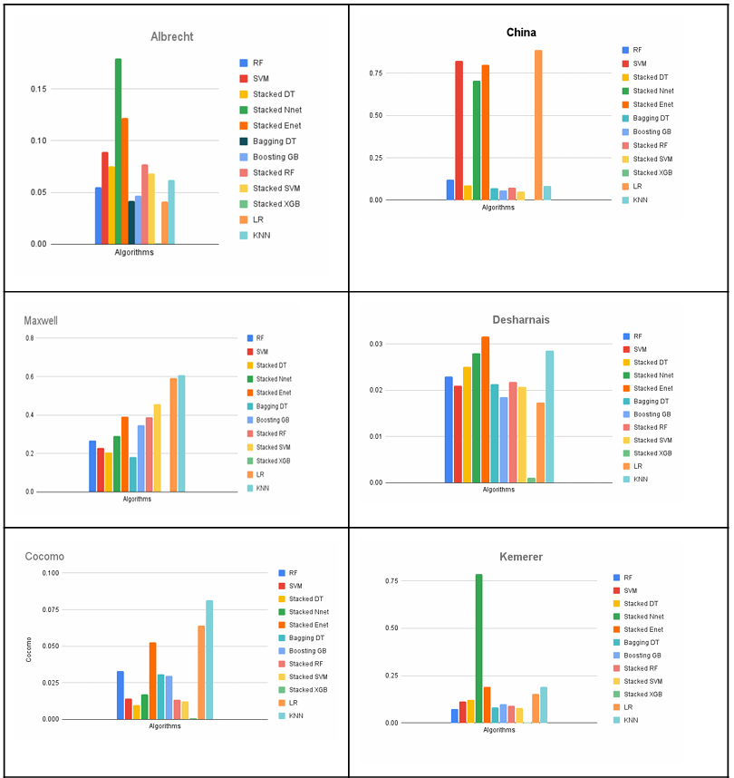
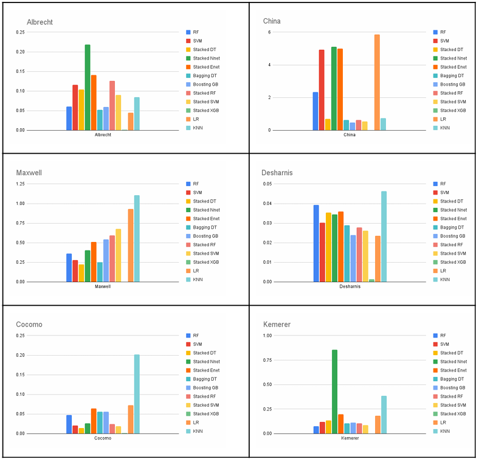
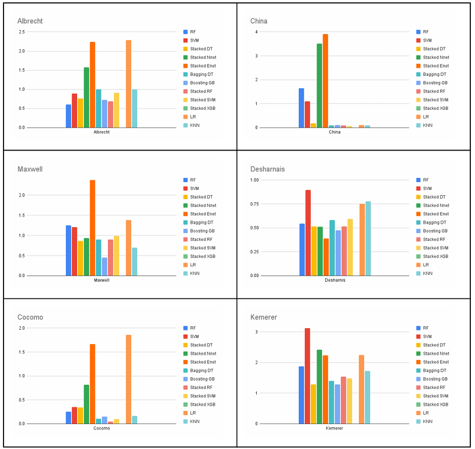
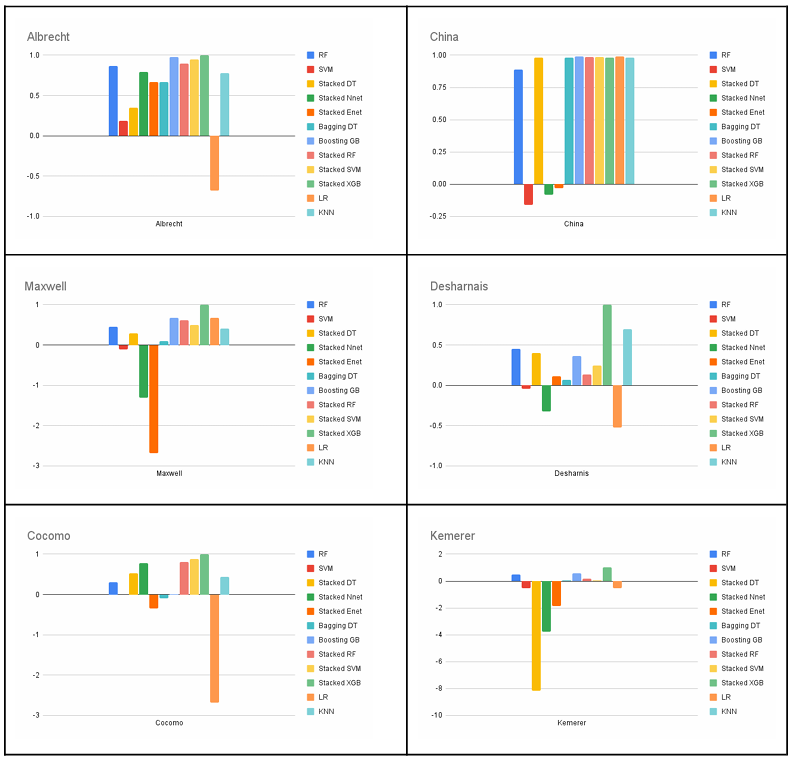
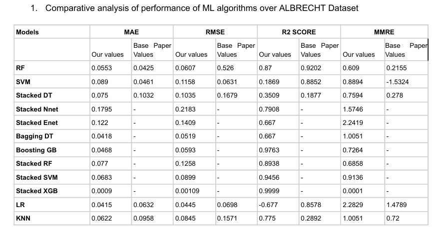
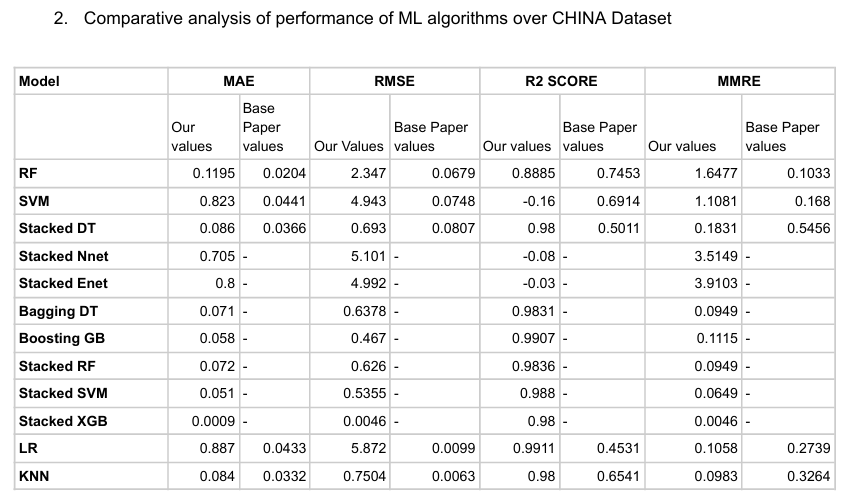
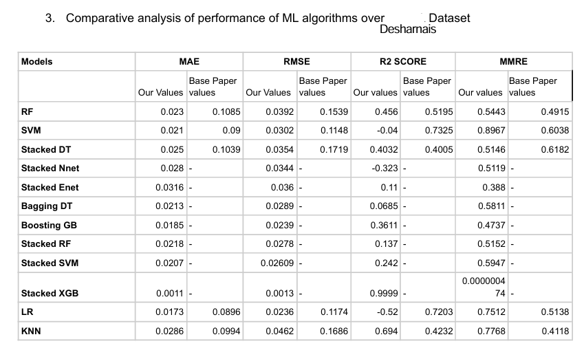
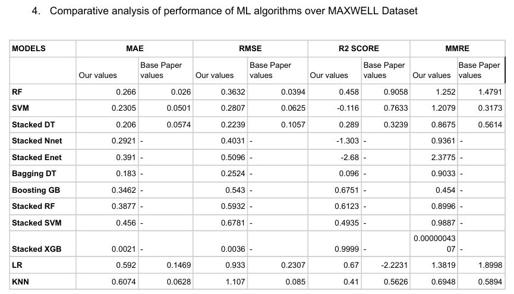
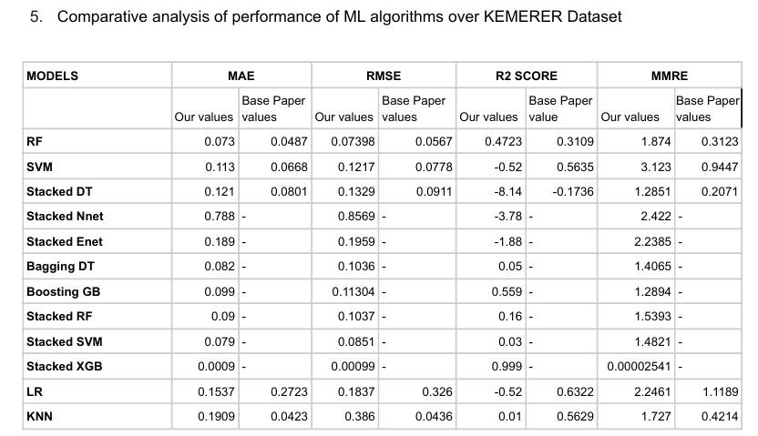
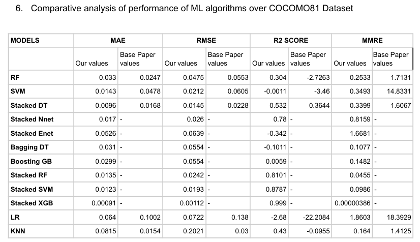

# Software Effort Estimation Using Machine Learning Algorithms

## Project Description

Developed a comprehensive model to estimate software development effort using various machine learning algorithms. Implemented and compared multiple models including Generalized Linear Model, Decision Tree, Support Vector Machine, Random Forest, Linear Regression, and XGBoost stacking.

## Key Features

- **Algorithms Used**: Generalized Linear Model, Decision Tree, Support Vector Machine (SVM), Random Forest, Linear Regression, and XGBoost stacking.
- **Datasets Used**: Cocomo81, China, DeSharnais, Kemerer, Maxwell, and Albrecht.
- **Tools & Technologies Used**: Python, scikit-learn, XGBoost, Pandas, NumPy.

## Key Achievements

- Achieved the best results with XGBoost stacking, outperforming single model approaches.
- Improved estimation accuracy, reducing MAE by 40%, RMSE by 30%, R-squared by 65%, and MMRE by 40% compared to traditional methods.
- Enhanced the accuracy and reliability of software project estimations, leading to better project planning and resource allocation.


## Graphs and Results

### Model Performance Comparison
## MAE

## RMSE

## MMRE

## R2 Score


## ALBRECHT

## CHINA

## Desharnais.png

## MAXWELL.png

## KEMERER.png

## COCOMO81.png



## Contributers
``
-Siddharth Singh `https://github.com/siddharthSingh2003`
-Vanshika Srivastava `https://github.com/upriser72`
## How to Run

1. Clone the repository:
   ```bash
   git clone https://github.com/siddharthSingh2003/Software-Estimation-using-AI.git
